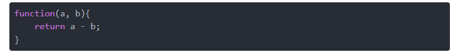
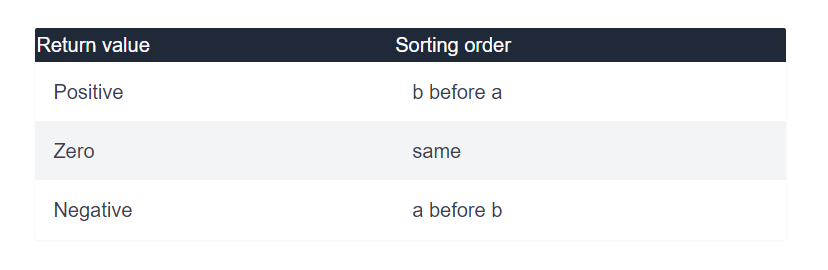
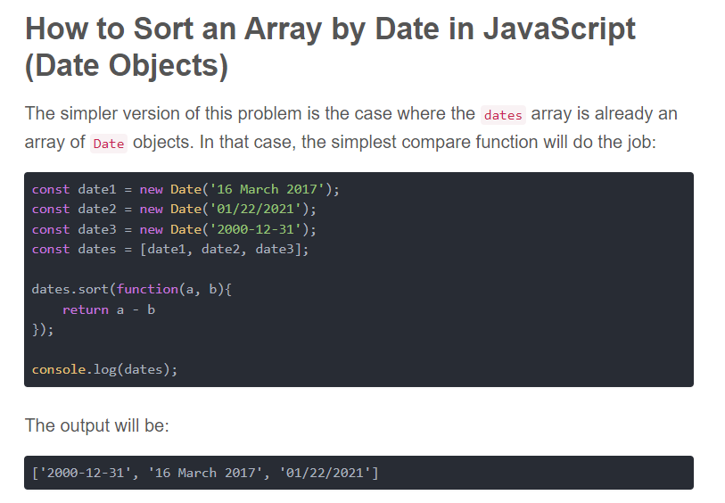
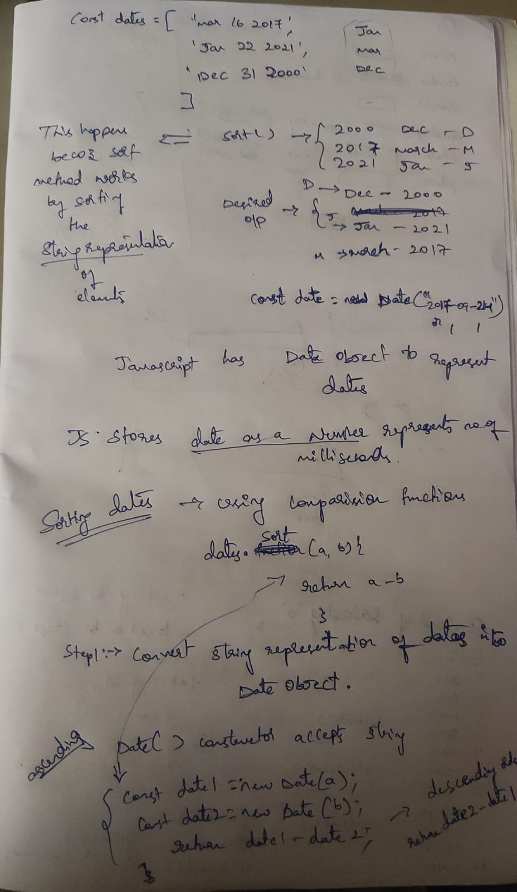
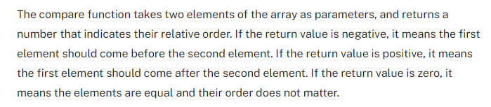

https://stackabuse.com/how-to-sort-an-array-by-date-in-javascript/

Sort() method in Javascript.

1. The sort() method works by converting the elements into strings.
2. the sort() method sorts elements in-place, meaning that it alters the original array:

